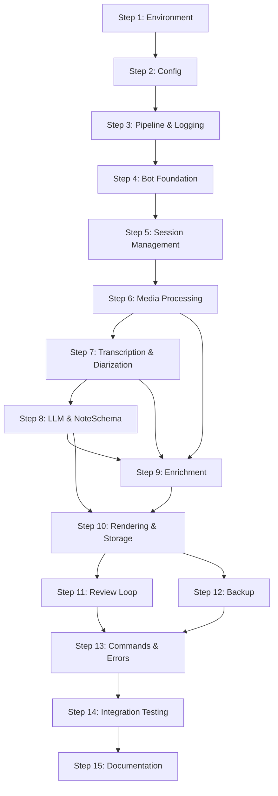

# vlog-journal — Implementation Plan

> Reference: [architecture_final.md](file:///home/wsl/documents/projects/diary-bot/architecture_final.md)
> Created: 2026-07-22

---

## Master Progress Checklist

- [x] **Phase 1: Foundation**
  - [x] Step 1 — Environment & Project Scaffolding
  - [x] Step 2 — Configuration System
  - [x] Step 3 — Pipeline Framework & Logging
- [x] **Phase 2: Telegram Bot Core**
  - [x] Step 4 — Bot Foundation & Middleware
  - [x] Step 5 — Session Management
- [ ] **Phase 3: Processing Pipeline**
  - [ ] Step 6 — Media Processing (FFmpeg)
  - [ ] Step 7 — Transcription & Speaker Diarization
  - [ ] Step 8 — LLM Integration & NoteSchema
- [ ] **Phase 4: Enrichment & Output**
  - [ ] Step 9 — Enrichment Pipeline (GPS, Weather, Stats)
  - [ ] Step 10 — Jinja2 Markdown Rendering & Vault Storage
- [ ] **Phase 5: Interactive Review & Backup**
  - [ ] Step 11 — Telegram Review Loop & Speaker Labeling
  - [ ] Step 12 — Encrypted Backup & Retention
- [ ] **Phase 6: Commands & Error Handling**
  - [ ] Step 13 — Advanced Bot Commands & Error Notifications
- [ ] **Phase 7: Testing & Documentation**
  - [ ] Step 14 — Integration Testing & End-to-End Validation
  - [ ] Step 15 — Documentation, README & Deployment Guide

---

## Phase 1: Foundation

---

### Step 1 — Environment & Project Scaffolding

#### Description

Set up the complete project structure, Nix flake, Docker Compose, `pyproject.toml`, and verify that all system-level dependencies (FFmpeg, Rclone, 7z, Ollama, CUDA) are accessible. This step produces a working dev shell with all tools available and a Python virtual environment with all dependencies installed.

#### Current State Analysis

- The project directory (`diary-bot/`) contains only `architecture.md` and discussion files.
- No `flake.nix`, `pyproject.toml`, `docker-compose.yml`, or source code exists yet.
- The target machine has WSL2 with Ubuntu, NVIDIA drivers, and CUDA passthrough (assumed functional).
- Nix and `direnv` may or may not be installed on the host.

#### Implementation Details

1. **Create directory structure** per architecture spec (Section 13):
   ```
   vlog-journal/
   ├── flake.nix
   ├── flake.lock
   ├── .envrc                    # direnv integration: "use flake"
   ├── .gitignore
   ├── config.example.toml
   ├── .env.example
   ├── docker-compose.yml
   ├── pyproject.toml
   ├── README.md
   ├── templates/
   │   ├── vlog_note.md.j2
   │   └── voice_note.md.j2
   ├── src/
   │   └── vlog_journal/
   │       ├── __init__.py
   │       ├── cli.py
   │       ├── config.py
   │       ├── bot/
   │       │   └── __init__.py
   │       ├── pipeline/
   │       │   └── __init__.py
   │       ├── processors/
   │       │   └── __init__.py
   │       ├── enrichment/
   │       │   └── __init__.py
   │       └── vault/
   │           └── __init__.py
   ├── data/                     # auto-created at runtime
   └── tests/
       ├── __init__.py
       ├── conftest.py
       └── ...
   ```

2. **Create `flake.nix`** with devShell containing: `uv`, `ffmpeg-full`, `rclone`, `p7zip`, `ollama`, `jq`, `git`.

3. **Create `pyproject.toml`** with all dependencies from architecture spec Section 14.1:
   - `pyTelegramBotAPI`, `faster-whisper`, `pyannote.audio`, `pydantic`, `pydantic-settings`, `litellm`, `aiofiles`, `torch`, `apscheduler`, `jinja2`, `structlog`, `reverse_geocoder`, `httpx`
   - Dev deps: `pytest`, `pytest-asyncio`, `ruff`

4. **Create `docker-compose.yml`** — Telegram Bot API server only (architecture spec Section 2.3).

5. **Create `.env.example`** and `config.example.toml`** — templates with placeholder values (architecture spec Sections 14.2, 14.3).

6. **Create `.gitignore`** — exclude `.env`, `data/`, `__pycache__/`, `.venv/`, `*.7z`, `.direnv/`.

7. **Create stub `cli.py`** — minimal entrypoint that loads config and prints a startup message.

8. **Verify Nix devShell** — `nix develop` should provide all system tools.

9. **Verify `uv sync`** — all Python packages install without errors.

10. **Verify Docker** — `docker compose up -d` starts the Telegram Bot API container.

11. **Verify CUDA** — `python -c "import torch; print(torch.cuda.is_available())"` returns `True`.

#### Files to Create

| File | Purpose |
|---|---|
| `flake.nix` | Nix devShell spec |
| `.envrc` | direnv hook (`use flake`) |
| `.gitignore` | VCS exclusions |
| `pyproject.toml` | Python package spec with all deps |
| `docker-compose.yml` | Telegram Bot API container |
| `.env.example` | Secrets template |
| `config.example.toml` | App config template |
| `src/vlog_journal/__init__.py` | Package init |
| `src/vlog_journal/cli.py` | Stub entrypoint |
| `src/vlog_journal/bot/__init__.py` | Bot package init |
| `src/vlog_journal/pipeline/__init__.py` | Pipeline package init |
| `src/vlog_journal/processors/__init__.py` | Processors package init |
| `src/vlog_journal/enrichment/__init__.py` | Enrichment package init |
| `src/vlog_journal/vault/__init__.py` | Vault package init |
| `templates/vlog_note.md.j2` | Empty placeholder |
| `templates/voice_note.md.j2` | Empty placeholder |
| `tests/__init__.py` | Tests package init |
| `tests/conftest.py` | Shared pytest fixtures |

#### Completion Checklist

- [x] All directories and stub files created per architecture Section 13
- [x] `nix develop` enters devShell with `ffmpeg`, `rclone`, `7z`, `ollama`, `jq`, `git`, `uv` all on PATH
- [x] `uv sync` completes without errors — all Python dependencies installed
- [x] `python -c "import torch; print(torch.cuda.is_available())"` prints a boolean
- [x] `python -c "import faster_whisper; print('ok')"` prints `ok`
- [x] `python -c "import litellm; print('ok')"` prints `ok`
- [x] `python -c "import structlog; print('ok')"` prints `ok`
- [x] `python -c "import reverse_geocoder; print('ok')"` prints `ok`
- [x] `docker compose up -d` starts `telegram_local_server` container without errors
- [x] `curl http://localhost:8081` returns a response (Bot API server is running)
- [x] `ollama serve &` starts successfully; `ollama list` responds
- [x] `uv run vlog-journal --help` runs the stub CLI without errors
- [x] `.env.example` contains all required keys per architecture Section 14.2
- [x] `config.example.toml` contains all sections per architecture Section 14.3
- [x] `git init && git add . && git commit` — clean initial commit
- [x] `ruff check src/` passes with zero errors

---

### Step 2 — Configuration System

#### Description

Implement `config.py` — a Pydantic Settings model that loads configuration from `config.toml` (application settings) and `.env` (secrets). This is the foundation that every other module depends on.

#### Current State Analysis

- Step 1 is complete: all dependencies installed, stub files in place.
- `config.example.toml` and `.env.example` exist as templates.
- No config loading logic exists yet.
- Python 3.11+ provides `tomllib` in stdlib (no extra dependency needed).

#### Implementation Details

1. **`src/vlog_journal/config.py`**:
   - Define `AppSettings` (Pydantic BaseSettings) with nested models for each TOML section:
     - `AppConfig` — vault paths, state files, session timeout
     - `MediaConfig` — resolution, fps, codecs, CRF
     - `TranscriptionConfig` — engine, model, language, device, compute_type
     - `DiarizationConfig` — enabled, min/max speakers
     - `LLMConfig` — provider, api_base, temperature, timeout
     - `LLMFallbackConfig` — fallback provider, temperature
     - `EnrichmentConfig` — GPS, geocode, weather, proximity dedup
     - `BackupConfig` — enabled, cron, remote, retention
     - `PipelinesConfig` — step name lists
   - Load TOML via `tomllib` (stdlib).
   - Load secrets from `.env` via `pydantic-settings` `env_file` support.
   - Validate resolution against `RESOLUTION_MAP` keys.
   - Provide a `load_config(path: Path) -> AppSettings` function.

2. **Update `cli.py`** to accept `--config` argument, call `load_config()`, and print loaded settings for verification.

3. **Create `tests/test_config.py`**:
   - Test loading from a valid TOML file.
   - Test defaults when optional fields are missing.
   - Test validation errors for invalid resolution values.
   - Test `.env` secret loading.

#### Files to Create / Modify

| File | Action |
|---|---|
| `src/vlog_journal/config.py` | Create — full config system |
| `src/vlog_journal/cli.py` | Modify — add `--config` loading |
| `tests/test_config.py` | Create — config unit tests |
| `config.example.toml` | Verify — matches config model fields |

#### Completion Checklist

- [x] `config.py` defines Pydantic models for all TOML sections from architecture Section 14.3
- [x] `load_config("config.toml")` returns a fully populated `AppSettings` object
- [x] Missing optional fields use sensible defaults (not crash)
- [x] Invalid `target_resolution` (e.g., `"999p"`) raises a `ValidationError`
- [x] `.env` secrets (TELEGRAM_BOT_TOKEN, HF_TOKEN, etc.) load into settings
- [x] `uv run vlog-journal --config config.toml` prints loaded config summary
- [x] `uv run pytest tests/test_config.py` — all tests pass
- [x] `ruff check src/vlog_journal/config.py` — zero errors

---

### Step 3 — Pipeline Framework & Logging

#### Description

Implement the pipeline execution engine: the `@register_step` decorator, `PipelineContext` dataclass, and the TOML-driven pipeline runner. Also set up `structlog` for structured logging throughout the application.

#### Current State Analysis

- Config system (Step 2) is complete and can load pipeline step lists from `config.toml`.
- No pipeline logic exists yet.
- Multiple modules will depend on `PipelineContext` and `@register_step`.

#### Implementation Details

1. **`src/vlog_journal/pipeline/registry.py`**:
   - `PipelineContext` dataclass:
     - `payload: dict[str, Any]` — mutable data passed between steps (clips, transcripts, drafts, etc.)
     - `metadata: dict[str, Any]` — read-only config values flattened from `AppSettings`
     - `chat_id: int` — Telegram chat ID for notifications
     - `notify: Callable[[str], Awaitable[None]]` — callback to send Telegram progress messages
   - `_STEP_REGISTRY: dict[str, Callable]` — global registry mapping step names to async functions.
   - `@register_step(name: str)` — decorator that registers an async function.
   - `get_step(name: str) -> Callable` — lookup with `KeyError` for unknown steps.

2. **`src/vlog_journal/pipeline/runner.py`**:
   - `async def run_pipeline(step_names: list[str], ctx: PipelineContext) -> PipelineContext`:
     - Iterates through step names in order.
     - Calls `ctx.notify(f"Running {step_name}...")` before each step.
     - Logs step entry/exit with duration via `structlog`.
     - On failure: logs error, sets `ctx.payload["error"]` and `ctx.payload["failed_step"]`, raises.
     - Tracks `pipeline_progress` index for retry support.
   - `async def run_pipeline_from(step_names, ctx, start_index)` — for `/retry` support.

3. **`src/vlog_journal/logging.py`**:
   - Configure `structlog` with:
     - JSON output for production, colored console output for development.
     - Processors: timestamp, log level, caller info.
     - Integration with stdlib `logging` (so third-party libs also get captured).
   - `setup_logging(debug: bool = False)` — called from `cli.py`.

4. **`tests/test_pipeline.py`**:
   - Test registering a step and looking it up.
   - Test running a 3-step pipeline with a mock context.
   - Test that a failing step sets error info and raises.
   - Test `run_pipeline_from` resumes from correct index.
   - Test that unknown step names raise `KeyError`.

#### Files to Create / Modify

| File | Action |
|---|---|
| `src/vlog_journal/pipeline/registry.py` | Create — PipelineContext, @register_step, registry |
| `src/vlog_journal/pipeline/runner.py` | Create — pipeline executor |
| `src/vlog_journal/logging.py` | Create — structlog setup |
| `src/vlog_journal/cli.py` | Modify — call `setup_logging()` on startup |
| `tests/test_pipeline.py` | Create — pipeline unit tests |

#### Completion Checklist

- [x] `PipelineContext` dataclass implemented with `state` dict and `notify()` method
- [x] `@register_step` properly adds functions to a global registry
- [x] `run_pipeline` executes steps sequentially, updates `pipeline_progress`, and passes `PipelineContext`
- [x] Failing steps populate `error` and `failed_step` in `PipelineContext.state` and raise
- [x] `setup_logging` configures `structlog` to output JSON/console correctly
- [x] `uv run pytest tests/test_pipeline.py` — all tests pass
- [x] `ruff check src/vlog_journal/pipeline/ src/vlog_journal/logging.py` — zero errors

---

## Phase 2: Telegram Bot Core

---

### Step 4 — Bot Foundation & Middleware

#### Description

Implement the Telegram bot using `pyTelegramBotAPI` (telebot) with async support, the user ID whitelist middleware, and basic command handlers (`/start`, `/help`). Connect the bot to the local Telegram Bot API server.

#### Current State Analysis

- Config system loads `TELEGRAM_BOT_TOKEN`, `ALLOWED_USER_IDS`, and `TELEGRAM_LOCAL_API_URL`.
- Pipeline framework exists but no steps are registered yet.
- Docker is running the local Telegram Bot API server on port 8081.
- No bot code exists.

#### Implementation Details

1. **`src/vlog_journal/bot/app.py`**:
   - Create `AsyncTeleBot` instance configured to use the local API server URL.
   - Register command handlers for `/start` and `/help`.
   - Integrate middleware for whitelist check.
   - `async def start_bot(settings: AppSettings)` — main entry point.
   - Set up `infinity_polling()` with error handling and auto-reconnect.

2. **`src/vlog_journal/bot/middleware.py`**:
   - `WhitelistMiddleware` — checks `message.from_user.id` against `ALLOWED_USER_IDS`.
   - Unauthorized users receive no response (silent drop).
   - Log unauthorized access attempts via `structlog`.

3. **`src/vlog_journal/bot/handlers.py`**:
   - `/start` — Welcome message with feature overview.
   - `/help` — List of all available commands with descriptions.
   - Stub handlers for `/start_session`, `/finish_session`, `/cancel`, `/backup`, `/sync_tags`, `/status`, `/retry` — respond with "Coming soon" for now.

4. **Update `cli.py`**:
   - `main()` calls `setup_logging()`, `load_config()`, then `start_bot(settings)`.
   - Handle `KeyboardInterrupt` for graceful shutdown.

5. **Manual testing** — send messages to the bot from Telegram, verify:
   - Whitelisted user gets responses.
   - Non-whitelisted user gets nothing.
   - `/help` lists commands.

#### Files to Create / Modify

| File | Action |
|---|---|
| `src/vlog_journal/bot/app.py` | Create — bot engine |
| `src/vlog_journal/bot/middleware.py` | Create — whitelist guard |
| `src/vlog_journal/bot/handlers.py` | Create — command handlers |
| `src/vlog_journal/cli.py` | Modify — wire up bot startup |

#### Completion Checklist

- [x] Bot connects to local Telegram API server (`http://localhost:8081`)
- [x] `/start` returns a welcome message
- [x] `/help` returns a list of all commands
- [x] Whitelisted user receives responses; non-whitelisted user is silently dropped
- [x] Unauthorized access attempts are logged via `structlog`
- [x] Bot handles `KeyboardInterrupt` — shuts down gracefully
- [x] Bot auto-reconnects on transient network errors
- [x] `ruff check src/vlog_journal/bot/` — zero errors

---

### Step 5 — Session Management

#### Description

Implement `SessionManager` with full pipeline state persistence (`data/sessions.json`), session lifecycle (collecting → processing → draft_pending → approved), and crash recovery.

#### Current State Analysis

- Bot foundation is running (Step 4).
- Config provides `sessions_state_file` path.
- No session logic exists — the bot can receive messages but can't track state.

#### Implementation Details

1. **`src/vlog_journal/bot/state.py`**:
   - `SessionManager` class with the schema from architecture Section 8.1:
     - `status`: `collecting | processing | draft_pending | approved`
     - `clips`: list of `{"path", "type", "caption"}` dicts
     - `entry_date`, `draft_markdown`, `note_schema`, `speaker_map`
     - `pipeline_progress`, `created_at`, `updated_at`, `error`
   - Methods:
     - `start_session(chat_id, date_override=None)`
     - `add_clip(chat_id, clip_path, media_type, caption=None)`
     - `set_status(chat_id, status)`
     - `update_payload(chat_id, **kwargs)` — update draft, schema, speaker map, etc.
     - `pop_session(chat_id)` — remove and return
     - `is_active(chat_id)` — check if session exists
     - `get_session(chat_id)` — return without removing
     - `get_pending_reviews()` — return all `draft_pending` sessions (for crash recovery)
     - `get_stale_sessions(timeout_hours)` — return sessions in `collecting` for too long
   - Persistence: `save_state()` called after every mutation; `load_state()` on init.
   - Thread safety: use a lock for concurrent access.

2. **Wire up handlers**:
   - `/start_session [date]` → calls `session_manager.start_session()`.
   - Video/voice message handler → calls `session_manager.add_clip()`.
   - `/finish_session` → sets status to `processing`, triggers pipeline (stub for now).
   - `/cancel` → calls `session_manager.pop_session()`, deletes temp files.

3. **Crash recovery in `app.py`**:
   - On startup, check `get_pending_reviews()` → re-send review keyboards.
   - Check `get_stale_sessions(timeout_hours)` → send reminders.
   - Check sessions in `processing` state → retry from `pipeline_progress` if > 0, or revert to `collecting` if progress is 0.

4. **`tests/test_state.py`**:
   - Test session lifecycle: create → add clips → set status → pop.
   - Test persistence: create session, reload from disk, verify data intact.
   - Test `get_pending_reviews()` returns only `draft_pending` sessions.
   - Test `get_stale_sessions()` with mocked timestamps.
   - Test clip type discrimination (video vs. voice).

#### Files to Create / Modify

| File | Action |
|---|---|
| `src/vlog_journal/bot/state.py` | Create — SessionManager |
| `src/vlog_journal/bot/handlers.py` | Modify — wire session commands |
| `src/vlog_journal/bot/app.py` | Modify — crash recovery on startup |
| `tests/test_state.py` | Create — session management tests |

#### Completion Checklist

- [x] `SessionManager` supports full lifecycle: `collecting → processing → draft_pending → approved`
- [x] Clips are stored as `{"path", "type", "caption"}` dicts (not parallel lists)
- [x] `sessions.json` is written to disk after every state mutation
- [x] Reloading `SessionManager` from disk recovers all active sessions
- [x] `/start_session` creates a new session; `/start_session 2026-07-20` overrides the date
- [x] Sending a video/voice message to the bot adds it to the active session
- [x] `/finish_session` transitions session to `processing`
- [x] `/cancel` removes the session and cleans up temp files
- [x] On startup, `draft_pending` sessions re-send review keyboards
- [x] On startup, stale `collecting` sessions get a reminder message
- [x] On startup, orphaned `processing` sessions retry from `pipeline_progress` or revert to `collecting`
- [x] `uv run pytest tests/test_state.py` — all tests pass
- [x] `ruff check src/vlog_journal/bot/state.py` — zero errors

---

## Phase 3: Processing Pipeline

---

### Step 6 — Media Processing (FFmpeg)

#### Description

Implement `media.py` — video/audio stitching, normalization, audio extraction, and temp file cleanup. This is the first registered pipeline step.

#### Current State Analysis

- Pipeline framework (Step 3) is ready — `@register_step` and `PipelineContext` work.
- Session manager (Step 5) provides clip paths and types.
- FFmpeg is available via Nix devShell.
- No media processing code exists.

#### Implementation Details

1. **`src/vlog_journal/processors/media.py`**:
   - **`@register_step("media.prepare_and_stitch")`**:
     - Reads `ctx.payload["clips"]` (list of clip dicts from session).
     - Extracts creation timestamps via `ffprobe` → sets `ctx.payload["entry_date"]` to `min()`.
     - All datetime parsing is timezone-aware (UTC from ffprobe, local TZ for fallback).
     - Detects media type: all audio → voice path; contains video → video path.
     - **Video path**: Scale, pad, normalize FPS, concat via `filter_complex`.
     - **Voice path**: Concatenate via `filter_complex` concat (NOT multi-input).
     - Reads codec/resolution/CRF from `ctx.metadata`.
     - Sets `ctx.payload["raw_video_path"]` or `ctx.payload["raw_audio_path"]`.
     - Sets `ctx.payload["is_voice_memo"]`.
   - **`@register_step("media.extract_audio")`**:
     - Extracts audio from stitched video → WAV file for Whisper.
     - `ffmpeg -i video.mp4 -vn -acodec pcm_s16le -ar 16000 -ac 1 output.wav`
     - Sets `ctx.payload["audio_wav_path"]`.
     - For voice-only sessions, `audio_wav_path` is already set — this step is a no-op.
   - **`@register_step("media.cleanup_temp_files")`**:
     - Deletes intermediate files: WAV, raw video, queued clips in temp dir.
     - Only runs on success or explicit discard.
   - **Helper: `get_item_creation_date(path)`** — timezone-aware ffprobe extraction.

2. **`RESOLUTION_MAP`** with all options including `360p`:
   ```python
   RESOLUTION_MAP = {
       "4k": "3840:2160", "1080p": "1920:1080", "720p": "1280:720",
       "480p": "854:480", "360p": "640:360", "240p": "426:240",
   }
   ```

3. **`tests/test_media.py`**:
   - Test `get_item_creation_date()` with a real short video clip (fixture).
   - Test resolution map lookup for all valid values.
   - Test that voice-only detection works (all `.ogg` files → `is_voice_memo = True`).
   - Test that mixed sessions (video + voice) → `is_voice_memo = False`.
   - Test FFmpeg command construction (mock subprocess, verify args).
   - Test cleanup removes temp files.

#### Files to Create / Modify

| File | Action |
|---|---|
| `src/vlog_journal/processors/media.py` | Create — media processor |
| `tests/test_media.py` | Create — media processing tests |
| `tests/fixtures/` | Create — small test video/audio files |

#### Completion Checklist

- [ ] `media.prepare_and_stitch` correctly resolves entry date from `min(creation_times)`
- [ ] All datetime comparisons use timezone-aware objects (no `TypeError`)
- [ ] Single video clip with `"original"` resolution passes through without re-encoding
- [ ] Multiple video clips are stitched with correct scaling, padding, and FPS normalization
- [ ] Multiple voice memos are concatenated via `filter_complex` concat (not just first file)
- [ ] `media.extract_audio` produces a 16 kHz mono WAV file from video
- [ ] `media.extract_audio` is a no-op for voice-only sessions
- [ ] `media.cleanup_temp_files` removes all intermediate files
- [ ] `RESOLUTION_MAP` includes all 7 options: original, 4k, 1080p, 720p, 480p, 360p, 240p
- [ ] FFmpeg errors raise `RuntimeError` with stderr content
- [ ] `uv run pytest tests/test_media.py` — all tests pass
- [ ] `ruff check src/vlog_journal/processors/media.py` — zero errors

---

### Step 7 — Transcription & Speaker Diarization

#### Description

Implement `transcriber.py` (Faster-Whisper) and `diarizer.py` (pyannote) with proper VRAM management — load models, process audio, merge speaker labels with transcript segments, then fully unload from GPU.

#### Current State Analysis

- Media processing (Step 6) produces a WAV file at `ctx.payload["audio_wav_path"]`.
- CUDA is verified working (Step 1).
- No transcription or diarization code exists.
- `HF_TOKEN` is required in `.env` for pyannote model download (first run only).

#### Implementation Details

1. **`src/vlog_journal/processors/transcriber.py`**:
   - **`@register_step("transcription.whisper_transcribe")`**:
     - Loads `faster_whisper.WhisperModel` with config settings (model name, device, compute_type).
     - Transcribes `audio_wav_path`.
     - Stores raw segments with timestamps and text in `ctx.payload["raw_segments"]`.
     - Stores detected language and confidence in `ctx.payload["detected_language"]` and `ctx.payload["confidence_avg"]`.
     - **Unloads Whisper model immediately after transcription** — segments are already stored in `ctx.payload`, no reason to keep the model in VRAM.
     - VRAM cleanup: `del whisper_model; gc.collect(); torch.cuda.empty_cache()`

2. **`src/vlog_journal/processors/diarizer.py`**:
   - **`@register_step("transcription.diarize_speakers")`**:
     - Loads `pyannote.audio.Pipeline` for speaker diarization.
     - Processes `audio_wav_path` with `min_speakers` / `max_speakers` from config.
     - Stores diarization result in `ctx.payload["diarization"]`.
     - If diarization is disabled in config, skip and set all segments to "Speaker 1".
     - **Unloads pyannote model immediately after diarization**: `del pipeline; gc.collect(); torch.cuda.empty_cache()`
   - **`@register_step("transcription.merge_segments")`**:
     - Pure Python step (no GPU) — merges Whisper segments with pyannote speaker labels by timestamp overlap.
     - Produces `ctx.payload["labeled_segments"]`: list of `{"speaker", "timestamp", "text"}`.
     - No VRAM cleanup needed — models are already unloaded.

3. **VRAM management pattern** — each step loads and unloads independently:
   ```python
   # whisper_transcribe step:
   model = WhisperModel(...)
   segments = model.transcribe(audio)
   ctx.payload["raw_segments"] = segments
   del model; gc.collect(); torch.cuda.empty_cache()  # Peak: ~3.0 GB → 0

   # diarize_speakers step:
   pipeline = Pipeline.from_pretrained(...)
   diarization = pipeline(audio)
   ctx.payload["diarization"] = diarization
   del pipeline; gc.collect(); torch.cuda.empty_cache()  # Peak: ~1.5 GB → 0

   # merge_segments step: pure Python, no GPU
   labeled_segments = merge(raw_segments, diarization)
   ```
   This keeps peak VRAM at ~3.0 GB (Whisper only), never ~4.5 GB (both simultaneous).

4. **`tests/test_transcriber.py`**:
   - Test Whisper model loading with a short audio fixture (CPU mode for CI).
   - Test segment format: each has `start`, `end`, `text`.
   - Test language detection returns a valid language code.
   - Test VRAM cleanup: verify `torch.cuda.memory_allocated()` drops after cleanup.
   - Test diarization disabled path: all segments get "Speaker 1".

#### Files to Create / Modify

| File | Action |
|---|---|
| `src/vlog_journal/processors/transcriber.py` | Create — Whisper transcription |
| `src/vlog_journal/processors/diarizer.py` | Create — pyannote diarization + merge |
| `tests/test_transcriber.py` | Create — transcription tests |
| `tests/fixtures/test_audio.wav` | Create — short test audio file |

#### Completion Checklist

- [ ] Whisper loads the configured model (`large-v3` by default) on CUDA
- [ ] Transcription produces timestamped segments from a WAV file
- [ ] Language detection returns `"ru"`, `"uk"`, `"en"`, etc.
- [ ] Per-segment confidence scores are captured; average stored in context
- [ ] pyannote diarization assigns speaker labels (`Speaker 1`, `Speaker 2`, etc.)
- [ ] Merge step correctly assigns speakers to transcript segments by timestamp overlap
- [ ] Whisper model is unloaded after transcription: `torch.cuda.memory_allocated()` drops to near-zero
- [ ] pyannote model is unloaded after diarization: `torch.cuda.memory_allocated()` drops to near-zero
- [ ] Merge step uses no GPU — pure Python operation
- [ ] Diarization disabled config → all segments labeled "Speaker 1"
- [ ] `ctx.payload["labeled_segments"]` contains `[{"speaker", "timestamp", "text"}, ...]`
- [ ] `uv run pytest tests/test_transcriber.py` — all tests pass
- [ ] `ruff check src/vlog_journal/processors/` — zero errors

---

### Step 8 — LLM Integration & NoteSchema

#### Description

Implement `llm.py` — the LiteLLM integration with Pydantic structured output, language-aware system prompt, Ollama→Gemini fallback, and the complete `NoteSchema` with health sub-models.

#### Current State Analysis

- Transcription (Step 7) produces `labeled_segments` in `ctx.payload`.
- Tag cache (`tags.json`) doesn't exist yet — will be empty list initially.
- Ollama is available via `ollama serve`; the configured model needs to be pulled.
- `GEMINI_API_KEY` may or may not be set in `.env`.

#### Implementation Details

1. **`src/vlog_journal/processors/schemas.py`**:
   - Define all Pydantic models from architecture Section 5.2:
     - `SleepNote`, `ExerciseNote`, `PainNote`, `MentalNote`
     - `HealthWellness`
     - `TranscriptSegment`
     - `NoteSchema` (Tier 1 + Tier 2 + Health)

2. **`src/vlog_journal/processors/llm.py`**:
   - **`@register_step("llm.structure_transcript")`**:
     - Builds system prompt with language policy (architecture Section 5.1).
     - Includes existing tags from `tags.json` for consistency.
     - Includes captions from session clips as context.
     - Includes speaker map if user has labeled speakers.
     - Formats `labeled_segments` into a readable transcript block.
     - Calls `litellm.acompletion()` with:
       - `model` from config
       - `response_format=NoteSchema` (structured output)
       - `timeout` from config
       - `fallbacks` from config
     - Validates response against `NoteSchema`.
     - If fallback was used, sets `ctx.payload["llm_fallback_used"] = True`.
     - Stores `NoteSchema` dict in `ctx.payload["note_schema"]`.
   - **System prompt** includes:
     - Language rules (English for structured fields, source language for transcript/summary).
     - People transliteration instruction.
     - Tag namespace hints (`#people/<name>`, `#topic/<subject>`, etc.).
     - Tier 2 instructions: "Return empty lists if not mentioned."
     - Health extraction: "Extract health info only if explicitly mentioned."
   - **Retry logic**: If Pydantic validation fails, retry once with error feedback.

3. **`tests/test_llm.py`**:
   - Test `NoteSchema` validation with a complete mock response.
   - Test `NoteSchema` validation with minimal response (all Tier 2 empty).
   - Test that invalid mood/energy values fail validation.
   - Test system prompt construction includes tags and captions.
   - Test fallback flag is set when primary model fails (mock LiteLLM).

#### Files to Create / Modify

| File | Action |
|---|---|
| `src/vlog_journal/processors/schemas.py` | Create — all Pydantic models |
| `src/vlog_journal/processors/llm.py` | Create — LLM integration |
| `tests/test_llm.py` | Create — LLM & schema tests |

#### Completion Checklist

- [ ] `NoteSchema` validates a complete response with all Tier 1, Tier 2, and health fields
- [ ] `NoteSchema` accepts empty Tier 2 fields (default_factory=list)
- [ ] System prompt includes language policy from architecture Section 5.1
- [ ] System prompt includes existing tags from `tags.json`
- [ ] System prompt includes session captions as context
- [ ] Speaker map (if provided) is included in the prompt for name resolution
- [ ] `litellm.acompletion()` is called with correct model, timeout, and fallbacks
- [ ] Fallback to Gemini works when Ollama is unavailable (test with Ollama stopped)
- [ ] `llm_fallback_used` flag is set correctly in payload
- [ ] Pydantic validation failure triggers one retry with error feedback
- [ ] `uv run pytest tests/test_llm.py` — all tests pass
- [ ] `ruff check src/vlog_journal/processors/` — zero errors

---

## Phase 4: Enrichment & Output

---

### Step 9 — Enrichment Pipeline (GPS, Weather, Stats)

#### Description

Implement the auto-extraction modules that don't require the LLM: GPS coordinate extraction from video metadata, offline reverse geocoding, weather fetching from Open-Meteo, and media statistics computation.

#### Current State Analysis

- Media processing (Step 6) has produced the stitched video/audio.
- Session clips have original file paths available for GPS extraction.
- `reverse_geocoder` and `httpx` are installed.
- No enrichment code exists.

#### Implementation Details

1. **`src/vlog_journal/enrichment/gps.py`**:
   - **`@register_step("enrichment.extract_gps")`**:
     - For each clip, run `ffprobe` to extract GPS from `format_tags=location`.
     - Parse GPS string format (e.g., `"+40.7128-074.0060/"`).
     - Deduplicate by proximity (configurable radius, default 500 m).
     - Store in `ctx.payload["locations_visited"]`: list of `{"lat", "lon", "clips", "time_range"}`.
   - **`@register_step("enrichment.reverse_geocode")`**:
     - For each unique GPS point, resolve to city/country via `reverse_geocoder.search()`.
     - Add `"name"` field to each location dict.
     - Set `ctx.payload["primary_location"]` (most clips or longest duration).
     - If no GPS data found, set fields to `null`.

2. **`src/vlog_journal/enrichment/weather.py`**:
   - **`@register_step("enrichment.fetch_weather")`**:
     - For each location in `locations_visited`, fetch weather from Open-Meteo using `httpx`.
     - URL: `https://api.open-meteo.com/v1/forecast?latitude=...&longitude=...&daily=temperature_2m_max,temperature_2m_min,weathercode&timezone=auto&start_date=...&end_date=...`
     - Map weather codes to human-readable strings (e.g., `"24°C, partly cloudy"`).
     - Add `"weather"` field to each location dict.
     - Set `ctx.payload["primary_weather"]`.
     - If fetch fails (no network), log warning and set weather to `null` — non-fatal.

3. **`src/vlog_journal/enrichment/stats.py`**:
   - **`@register_step("enrichment.compute_media_stats")`**:
     - Compute and store in `ctx.payload`:
       - `duration` — from ffprobe or sum of clip durations.
       - `clip_count` — from session data.
       - `word_count` — from labeled_segments text length.
       - `speaking_pace_wpm` — word_count / duration_minutes.
       - `speakers` — count of unique speaker labels.
       - `recording_device` — from ffprobe metadata.
       - `original_resolution` — from ffprobe.
       - `file_size_mb` — from final media file.

4. **`tests/test_enrichment.py`**:
   - Test GPS string parsing for various formats.
   - Test proximity deduplication (two points 100 m apart → same location).
   - Test reverse geocoding returns a city name (offline, deterministic).
   - Test weather code mapping (code 0 → "clear sky", etc.).
   - Test media stats computation with mock ffprobe output.
   - Test graceful failure when no GPS data exists.
   - Test graceful failure when weather API is unreachable.

#### Files to Create / Modify

| File | Action |
|---|---|
| `src/vlog_journal/enrichment/gps.py` | Create — GPS extraction & geocoding |
| `src/vlog_journal/enrichment/weather.py` | Create — Open-Meteo weather |
| `src/vlog_journal/enrichment/stats.py` | Create — media statistics |
| `tests/test_enrichment.py` | Create — enrichment tests |

#### Completion Checklist

- [ ] GPS extraction parses `ffprobe` location tags from video files
- [ ] GPS deduplication merges points within configured proximity radius
- [ ] `reverse_geocoder` resolves GPS coordinates to city names (offline, no API key)
- [ ] `primary_location` is set to the location with the most clips
- [ ] Weather is fetched from Open-Meteo for each location
- [ ] Weather codes are mapped to human-readable strings (e.g., `"24°C, partly cloudy"`)
- [ ] Weather fetch failure is non-fatal — logs warning, sets `null`
- [ ] Missing GPS data is non-fatal — logs warning, sets `null`
- [ ] Media stats (duration, word count, WPM, speakers, device, resolution, file size) are computed
- [ ] `uv run pytest tests/test_enrichment.py` — all tests pass
- [ ] `ruff check src/vlog_journal/enrichment/` — zero errors

---

### Step 10 — Jinja2 Markdown Rendering & Vault Storage

#### Description

Implement the Jinja2 template renderer, the vault storage module with same-day collision protection, and the tag manager with write-through cache and reconciliation.

#### Current State Analysis

- NoteSchema (Step 8) provides all structured data for the template.
- Enrichment (Step 9) provides GPS, weather, and media stats.
- Template files (`vlog_note.md.j2`, `voice_note.md.j2`) exist as placeholders.
- No vault interaction code exists.

#### Implementation Details

1. **`src/vlog_journal/vault/renderer.py`**:
   - **`@register_step("vault.render_markdown")`**:
     - Loads Jinja2 template (`vlog_note.md.j2` or `voice_note.md.j2` based on `is_voice_memo`).
     - Combines NoteSchema data, auto-extracted fields, and enrichment data into template context.
     - Generates hierarchical tags from LLM fields:
       - `people` → `#people/<name>` (lowercased, spaces to hyphens)
       - `topics` → `#topic/<subject>`
       - `primary_location` → `#location/<city>` (lowercased)
       - `category` → `#category/<type>`
       - Always includes `#journal/vlog`
     - Renders template → stores in `ctx.payload["draft_markdown"]`.

2. **`templates/vlog_note.md.j2`**:
   - Full Jinja2 template matching architecture Section 6.3:
     - YAML frontmatter block with all fields (core, LLM Tier 1, Tier 2, health, location, media stats, system).
     - Body: heading, media embed wikilink, summary blockquote, highlights, action items (as checkboxes), notable quotes, collapsible transcript.
   - Template receives the collision-aware media filename.

3. **`templates/voice_note.md.j2`**:
   - Similar to vlog template but with audio embed (`![[YYYY-MM-DD-audio.mp3]]`) and no video-specific fields.

4. **`src/vlog_journal/vault/storage.py`**:
   - **`@register_step("vault.save_entry")`**:
     - Resolves collision suffix (`-02`, `-03`, etc.) per architecture Section 6.1.
     - Moves media file to `Attachments/Vlogs/` with correct suffix.
     - Writes markdown to `Journal/Vlogs/` with correct suffix.
     - Stores `ctx.payload["final_markdown_path"]`.

5. **`src/vlog_journal/vault/tags.py`**:
   - `TagManager` class:
     - `load()` — reads `tags.json` or returns empty list.
     - `get_tags()` — returns sorted unique tags.
     - `add_tags(new_tags: list[str])` — write-through append + dedup.
     - `sync_from_vault(vault_path)` — scans ALL `.md` files, parses YAML frontmatter `tags` field, rebuilds `tags.json`.
   - **`@register_step("vault.update_tag_cache")`**:
     - Extracts tags from the saved note's frontmatter.
     - Calls `tag_manager.add_tags()`.

6. **`tests/test_vault.py`**:
   - Test collision resolver: first file → no suffix, second → `-02`, third → `-03`.
   - Test media file is moved correctly.
   - Test markdown file is written with correct content.
   - Test tag generation from people/topics/location/category.
   - Test tag cache write-through.
   - Test tag reconciliation from vault scan.
   - Test Jinja2 template renders valid frontmatter + body.

#### Files to Create / Modify

| File | Action |
|---|---|
| `src/vlog_journal/vault/renderer.py` | Create — Jinja2 markdown builder |
| `src/vlog_journal/vault/storage.py` | Create — file mover & collision resolver |
| `src/vlog_journal/vault/tags.py` | Create — TagManager & cache |
| `templates/vlog_note.md.j2` | Create — full Jinja2 template |
| `templates/voice_note.md.j2` | Create — voice-only template |
| `tests/test_vault.py` | Create — vault tests |

#### Completion Checklist

- [ ] Jinja2 template renders valid YAML frontmatter + markdown body
- [ ] Frontmatter includes ALL fields from architecture Section 6.2
- [ ] Tags are auto-generated from LLM fields (people, topics, location, category)
- [ ] `#journal/vlog` tag is always present
- [ ] Summary is in the main spoken language; highlights in English
- [ ] Transcript is in a collapsible `> [!NOTE]-` callout
- [ ] Action items render as `- [ ]` checkboxes
- [ ] Same-day collision protection works: 1st → `2026-07-20.md`, 2nd → `2026-07-20-02.md`
- [ ] Media file is moved to `Attachments/Vlogs/` with matching collision suffix
- [ ] Wikilink in template uses the collision-aware filename
- [ ] `TagManager` loads, saves, and deduplicates `tags.json`
- [ ] `/sync_tags` scans all `.md` files and rebuilds tag cache
- [ ] `uv run pytest tests/test_vault.py` — all tests pass
- [ ] `ruff check src/vlog_journal/vault/` — zero errors

---

## Phase 5: Interactive Review & Backup

---

### Step 11 — Telegram Review Loop & Speaker Labeling

#### Description

Implement the interactive Telegram review flow: display draft to user with inline keyboard, handle approve/edit/discard, support speaker relabeling (re-trigger LLM), and date override.

#### Current State Analysis

- Pipeline produces `draft_markdown` and `note_schema` in session payload.
- Session state tracks `draft_pending` status.
- Bot handlers exist but review flow is not implemented.
- Speaker map in session schema is ready for labeling data.

#### Implementation Details

1. **Review message construction**:
   - Format a preview message for Telegram (Markdown v2):
     - Title, summary, mood, key highlights (truncated to fit Telegram message limits).
     - Speaker list (e.g., "Speaker 1, Speaker 2") — prompt user to label.
   - Inline keyboard: `[✅ Approve]` `[✏️ Edit]` `[❌ Discard]`

2. **Callback handlers**:
   - **Approve**: Trigger `vault.save_entry` → `vault.update_tag_cache` → `media.cleanup_temp_files`. Send confirmation. Set session status to `approved`.
   - **Edit**: Send sub-menu with options:
     - "Label speakers (e.g., 'Speaker 1 = Mom')"
     - "Change date"
     - "Free-text correction"
   - **Discard**: Delete temp files, pop session, confirm.

3. **Speaker labeling flow**:
   - User sends: `Speaker 1 = Me, Speaker 2 = Mom`
   - Parse and store in `session.speaker_map`.
   - Re-trigger `llm.structure_transcript` with the speaker map → re-render markdown → re-send review.
   - Fallback notification if LLM used Gemini for re-generation.

4. **Date override flow**:
   - User sends: `2026-07-19` or `yesterday`
   - Update `session.entry_date`.
   - Re-render markdown with new date → re-send review.

5. **Message length handling**:
   - Telegram messages cap at 4096 characters. If the preview exceeds this, truncate transcript and add "... (truncated for preview)".

#### Files to Create / Modify

| File | Action |
|---|---|
| `src/vlog_journal/bot/handlers.py` | Modify — add review callbacks |
| `src/vlog_journal/bot/review.py` | Create — review message builder & callback logic |

#### Completion Checklist

- [ ] Draft preview displays title, summary, mood, highlights, and speaker list
- [ ] Inline keyboard shows `[✅ Approve]` `[✏️ Edit]` `[❌ Discard]`
- [ ] `[✅ Approve]` saves note, updates tags, cleans up, sends confirmation
- [ ] `[❌ Discard]` removes session, deletes temp files, sends confirmation
- [ ] `[✏️ Edit]` opens sub-menu with labeling, date, and free-text options
- [ ] Speaker labeling parses input, updates speaker map, re-triggers LLM, re-sends review
- [ ] Date override updates entry date, re-renders template, re-sends review
- [ ] Messages exceeding 4096 chars are truncated gracefully
- [ ] Session status transitions correctly through the review flow
- [ ] Re-sent review after edits replaces the previous review message (not duplicate)
- [ ] `ruff check src/vlog_journal/bot/` — zero errors

---

### Step 12 — Encrypted Backup & Retention

#### Description

Implement the encrypted backup system: 7z archive creation via `py7zr` (passphrase stays in Python memory, never in process args), Rclone upload to Google Drive, and 2-daily + 1-weekly retention policy with proper subprocess awaiting.

#### Current State Analysis

- `rclone` is available via Nix devShell.
- Config provides backup settings (cron, remote, retention).
- `.env` provides `BACKUP_ENCRYPTION_PASSPHRASE` and `RCLONE_CONFIG_*`.
- `apscheduler` is installed for cron scheduling.
- No backup code exists.

> [!IMPORTANT]
> **7z stdin passphrase fix**: The original architecture spec used 7z's `-si` flag to pass the passphrase via stdin. However, `-si` in 7z means "read **archive data** from stdin", not the password. Standard `p7zip` has no stdin passphrase mode. We use `py7zr` (pure Python) instead — the passphrase stays in Python process memory and never appears in `/proc/*/cmdline`.

#### Implementation Details

1. **`src/vlog_journal/vault/backup.py`**:
   - **`@register_step("vault.create_encrypted_archive")`**:
     - Determine tag: `weekly` if Sunday, else `daily`.
     - Create 7z archive with AES-256 encryption using `py7zr` (pure Python, no subprocess):
       ```python
       import py7zr

       with py7zr.SevenZipFile(archive_path, 'w', password=passphrase) as archive:
           archive.writeall(vault_path, arcname=vault_path.name)
       ```
     - Passphrase stays in Python memory — never exposed in process arguments.
     - Store `archive_path` and `archive_name` in context.
   - **`@register_step("vault.upload_and_prune_remote")`**:
     - `rclone copy` archive to remote.
     - `rclone lsjson` to list remote files.
     - Prune: keep last N dailies and M weeklies, delete oldest.
     - **All deletion subprocesses are properly awaited** (`await proc.wait()`).
     - Delete local archive after successful upload.

2. **Cron scheduling** in `bot/app.py`:
   - If `backup.enabled` and `backup.schedule_cron` are set, register APScheduler cron job on startup.
   - Cron job triggers the `backup_vault` pipeline.

3. **`/backup` command** — manually triggers `backup_vault` pipeline.

4. **`tests/test_backup.py`**:
   - Test archive creation with a small test directory.
   - Test that passphrase is NOT in process arguments (check `proc.args`).
   - Test retention logic: given 5 dailies and 3 weeklies, correct files are marked for deletion.
   - Test deletion commands are awaited.

#### Files to Create / Modify

| File | Action |
|---|---|
| `src/vlog_journal/vault/backup.py` | Create — backup & retention |
| `src/vlog_journal/bot/app.py` | Modify — add APScheduler cron |
| `src/vlog_journal/bot/handlers.py` | Modify — add `/backup` handler |
| `tests/test_backup.py` | Create — backup tests |

#### Completion Checklist

- [ ] 7z archive is created with AES-256 encryption via `py7zr` (pure Python, no subprocess)
- [ ] Passphrase stays in Python memory, NOT visible in `ps aux` or `/proc/*/cmdline`
- [ ] Archive is named `vlog_backup_YYYY-MM-DD_daily.7z` or `_weekly.7z` (Sunday)
- [ ] `rclone copy` uploads archive to configured Google Drive remote
- [ ] Retention: keeps last 2 dailies and 1 weekly, deletes older archives
- [ ] All `rclone deletefile` subprocesses are properly awaited
- [ ] Local archive is deleted after successful upload
- [ ] APScheduler cron fires at configured time (default 4:00 AM)
- [ ] `/backup` command triggers manual backup and reports result
- [ ] Backup failure sends Telegram error notification
- [ ] `uv run pytest tests/test_backup.py` — all tests pass
- [ ] `ruff check src/vlog_journal/vault/backup.py` — zero errors

---

## Phase 6: Commands & Error Handling

---

### Step 13 — Advanced Bot Commands & Error Notifications

#### Description

Implement remaining bot commands (`/status`, `/retry`, `/sync_tags`) and the error notification system that alerts the user via Telegram when any pipeline step fails.

#### Current State Analysis

- All pipeline steps are implemented (Steps 6–12).
- Session management tracks `error` and `pipeline_progress` (Step 5).
- Stub handlers exist for advanced commands (Step 4).
- No error notification system exists beyond logging.

#### Implementation Details

1. **`/status` command**:
   - Check Ollama status: `httpx.get("http://localhost:11434/api/tags")`.
   - Check GPU VRAM: `torch.cuda.memory_allocated()` / `torch.cuda.get_device_properties(0).total_mem`.
   - Check disk space on vault path: `shutil.disk_usage()`.
   - Check Rclone connectivity: `rclone about gdrive:` (with short timeout).
   - Count active sessions.
   - Format as a Telegram message with emoji status indicators.

2. **`/retry` command**:
   - If session has `error` set and `pipeline_progress` recorded:
     - `/retry` → `run_pipeline_from(steps, ctx, start_index=pipeline_progress)`
     - `/retry full` → `run_pipeline(steps, ctx)` from the beginning.
   - Clear error state before retrying.
   - If no error to retry, respond with "No failed pipeline to retry."

3. **`/sync_tags` command**:
   - Call `tag_manager.sync_from_vault(vault_path)`.
   - Report: "Synced N tags from M files."

4. **Error notification wrapper**:
   - Wrap `run_pipeline()` calls in try/except.
   - On failure: send Telegram message with step name, error message, and `/retry` hint.
   - Store error details in session state.

5. **Session timeout checker**:
   - On startup + periodic check (every hour via APScheduler):
     - Find sessions in `collecting` state for >N hours (configurable).
     - Send reminder: "⏰ You have N clips from X hours ago. /finish_session or /cancel?"

#### Files to Create / Modify

| File | Action |
|---|---|
| `src/vlog_journal/bot/handlers.py` | Modify — implement /status, /retry, /sync_tags |
| `src/vlog_journal/bot/app.py` | Modify — add error wrapper & session timeout checker |

#### Completion Checklist

- [ ] `/status` reports: Ollama status, GPU VRAM usage, disk space, Rclone connectivity, active sessions
- [ ] `/retry` resumes pipeline from the failed step
- [ ] `/retry full` re-runs the entire pipeline
- [ ] `/retry` with no error state responds "No failed pipeline to retry"
- [ ] `/sync_tags` scans vault and reports tag count
- [ ] Pipeline failures send Telegram alert with step name, error message, and `/retry` hint
- [ ] Error details are stored in session state for retry
- [ ] Stale session reminder fires for sessions collecting >N hours
- [ ] All commands respond appropriately when no session is active
- [ ] `ruff check src/vlog_journal/bot/` — zero errors

---

## Phase 7: Testing & Documentation

---

### Step 14 — Integration Testing & End-to-End Validation

#### Description

Verify the complete pipeline works end-to-end: from a real video/voice upload through transcription, LLM processing, enrichment, vault storage, and backup. Test with actual media files and a real Obsidian vault.

#### Current State Analysis

- All individual components are implemented and unit-tested (Steps 1–13).
- No end-to-end testing has been done.
- Edge cases (multi-speaker, mixed language, same-day collision, voice-only) are untested as a full pipeline.

#### Implementation Details

1. **`tests/test_integration.py`** — end-to-end pipeline tests:
   - **Test: Single video clip** — full pipeline from clip to saved `.md` file.
   - **Test: Multi-clip session** — 3 clips stitched, correct date resolution.
   - **Test: Voice-only session** — multiple `.ogg` files concatenated, saved as MP3.
   - **Test: Mixed session** — video + voice memos combined.
   - **Test: Same-day collision** — two entries on same date produce `-02` suffix.
   - **Test: Speaker labeling** — relabel and re-generate.
   - **Test: Crash recovery** — kill bot mid-pipeline, restart, verify recovery.
   - **Test: LLM fallback** — stop Ollama, verify Gemini fallback fires.
   - **Test: No GPS** — clip without GPS data → `null` location fields.
   - **Test: No network** — weather fetch fails gracefully.

2. **Manual validation checklist**:
   - Record a real 2-minute video on phone.
   - Send to bot via Telegram.
   - Walk through entire flow: upload → process → review → approve.
   - Open saved `.md` in Obsidian — verify frontmatter, template, wikilink, transcript.
   - Verify media file plays from Obsidian.
   - Verify tags appear in tag cache.
   - Run `/backup` — verify archive on Google Drive.
   - Test `/status` command output.

3. **Performance benchmarks**:
   - Measure pipeline duration for a 5-minute video clip.
   - Measure VRAM usage peaks during transcription and LLM phases.
   - Document baseline performance for future comparison.

#### Files to Create / Modify

| File | Action |
|---|---|
| `tests/test_integration.py` | Create — end-to-end tests |
| `tests/fixtures/` | Add — real test media files (short clips) |

#### Completion Checklist

- [ ] Single video clip → complete `.md` file with correct frontmatter in Obsidian vault
- [ ] Multi-clip session → stitched video with correct date resolution
- [ ] Voice-only session → concatenated MP3 with audio embed in note
- [ ] Same-day collision → second entry gets `-02` suffix on both `.md` and media
- [ ] Speaker labeling → re-generated note has correct speaker names
- [ ] Crash recovery → bot restart recovers `draft_pending` sessions
- [ ] LLM fallback → Gemini used when Ollama unavailable; `llm_fallback_used: true`
- [ ] No GPS data → location fields are `null`, pipeline doesn't crash
- [ ] No network → weather is `null`, pipeline doesn't crash
- [ ] Saved `.md` opens correctly in Obsidian with valid frontmatter
- [ ] Media file plays from Obsidian via wikilink
- [ ] Tags from saved note appear in `data/tags.json`
- [ ] `/backup` produces encrypted archive on Google Drive
- [ ] `/status` reports correct system state
- [ ] Pipeline completes within reasonable time (~3–5 min for a 5-min video)
- [ ] VRAM peak stays within 8 GB at all phases
- [ ] `ruff check src/` — zero errors across entire codebase
- [ ] `uv run pytest` — all tests pass (unit + integration)

---

### Step 15 — Documentation, README & Deployment Guide

#### Description

Write comprehensive documentation: README with features, setup guide, usage examples; update architecture spec with any implementation-time changes; write deployment guide for fresh machine setup.

#### Current State Analysis

- All code is implemented and tested (Steps 1–14).
- `README.md` is a placeholder.
- Architecture spec exists but may have minor deviations from implementation.

#### Implementation Details

1. **`README.md`**:
   - Project description and feature list.
   - Architecture diagram (text-based, from architecture spec).
   - Prerequisites (hardware, software).
   - Quick start guide (5-step setup from architecture Section 15).
   - Configuration reference (key settings explained).
   - Bot commands reference.
   - Obsidian note format example.
   - Screenshots of Telegram interaction (if available).
   - Contributing guidelines.
   - License.

2. **Update `architecture_final.md`**:
   - Document any deviations or additions made during implementation.
   - Update code snippets if implementations differ from spec.

3. **`DEPLOYMENT.md`** (optional):
   - Fresh machine setup: Nix installation, WSL2 config, NVIDIA drivers.
   - First-time setup: HuggingFace token, Telegram bot creation, Google Drive Rclone config.
   - Troubleshooting common issues (CUDA OOM, Rclone auth, Telegram API).

#### Files to Create / Modify

| File | Action |
|---|---|
| `README.md` | Rewrite — full documentation |
| `architecture_final.md` | Update — implementation-time changes |
| `DEPLOYMENT.md` | Create — fresh machine setup guide |

#### Completion Checklist

- [ ] `README.md` contains: description, features, architecture diagram, quick start, config reference, commands
- [ ] Quick start guide works on a fresh clone (5 steps from zero to running bot)
- [ ] All bot commands are documented with examples
- [ ] Obsidian note format is shown with a full example
- [ ] `architecture_final.md` reflects actual implementation (no stale info)
- [ ] Prerequisites are clearly listed (Nix, WSL2, NVIDIA driver, Docker)
- [ ] First-time setup instructions cover: HF token, Telegram bot, Rclone config
- [ ] Troubleshooting section covers common failure modes
- [ ] `DEPLOYMENT.md` covers fresh machine setup (Nix, WSL2, CUDA, Docker, HF token, Rclone)

---

## Dependency Graph



---

## Estimated Effort

| Phase | Steps | Estimate |
|---|---|---|
| Phase 1: Foundation | 1–3 | ~1 day |
| Phase 2: Bot Core | 4–5 | ~1 day |
| Phase 3: Processing | 6–8 | ~2–3 days |
| Phase 4: Enrichment & Output | 9–10 | ~1–2 days |
| Phase 5: Review & Backup | 11–12 | ~1–2 days |
| Phase 6: Commands | 13 | ~0.5 day |
| Phase 7: Testing & Docs | 14–15 | ~1–2 days |
| **Total** | **15 steps** | **~8–12 days** |
